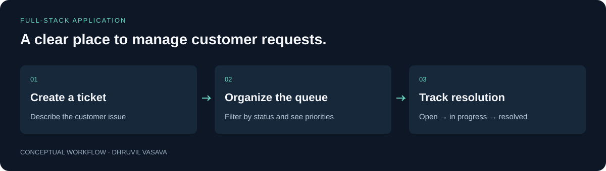
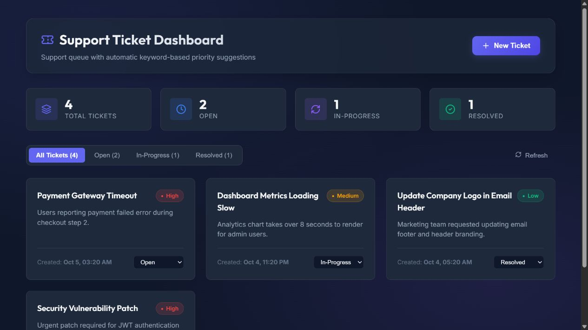

# Support Ticket Dashboard

**A clear place to manage customer requests.**

A support dashboard for creating customer tickets, organizing the queue, and tracking each request from open to resolved.

Built around a familiar support-team workflow, with a React interface and an Express API behind it.



[Quick start](#try-it-locally) · [Technical guide](docs/TECHNICAL_GUIDE.md) · [Checks](https://github.com/Dhruvil151/support-ticket-dashboard/actions) · [Portfolio](https://github.com/Dhruvil151)

## Preview



Actual local application, using the repository’s fictional seed tickets.

## A simple example

A customer reports a checkout problem. A team member creates a ticket, reviews its suggested priority, moves it into progress, and marks it resolved once the issue is fixed.

## What it does

- Create tickets and update their status.
- Filter the queue while keeping overall status counts visible.
- Suggest a priority using explicit keyword rules.
- Handle invalid input, loading states, and API errors.

## Try it locally

```sh
npm --prefix backend ci
npm --prefix frontend ci
```

Start these in separate terminals:

```sh
npm --prefix backend run dev
```

```sh
npm --prefix frontend run dev
```

Requires Node.js 24. Open `http://localhost:3000`; API documentation is at `http://localhost:5000/api-docs`. No API keys are needed.

## How it is built

**React · JavaScript · Express · Joi · OpenAPI · Vitest · Jest · Docker**

Controllers, services, and a repository separate HTTP handling, application behavior, and storage. This makes the current in-memory repository replaceable without moving database concerns into the UI.

See the [technical guide](docs/TECHNICAL_GUIDE.md) for setup details, architecture, and implementation boundaries.

## Checks and evidence

```sh
npm test
npm --prefix frontend run build
```

Tests cover backend behavior and frontend components. Docker setup and the API contract are in the technical guide.

The [publication validation report](VALIDATION.md) records earlier checks and their limits. GitHub Actions records checks for subsequent commits.

## Current scope

Portfolio demo with seeded sample tickets. Data resets when the backend restarts. Priority suggestions are keyword rules; accounts, roles, and persistent storage are not implemented.

